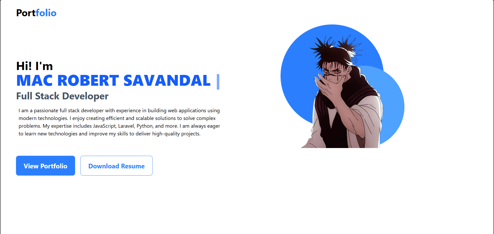
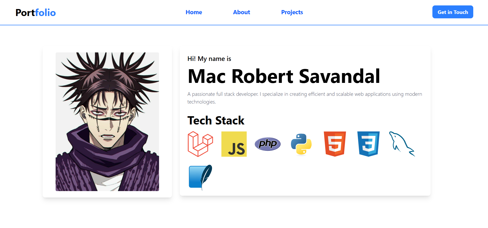
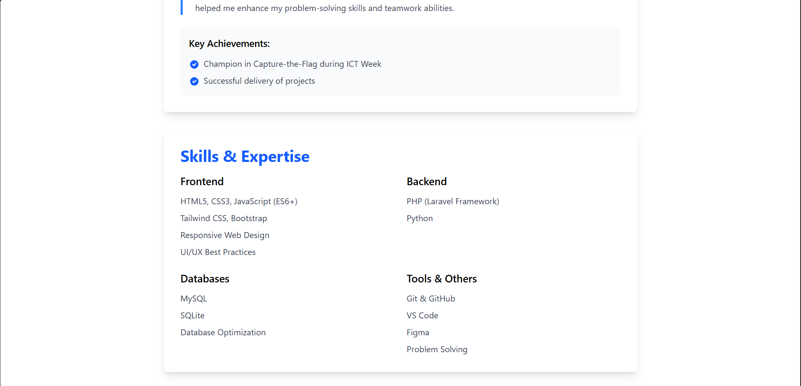
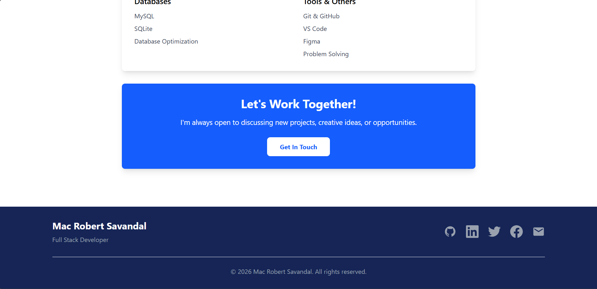
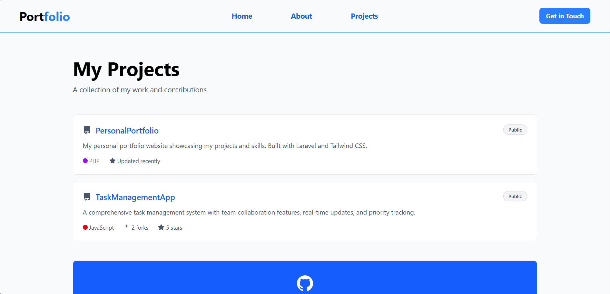
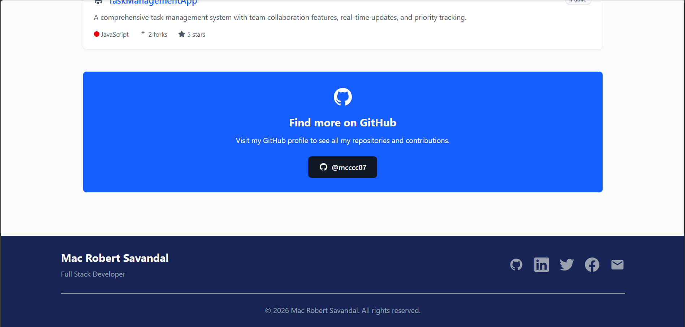

# 🌐 Personal Portfolio

Welcome to my Personal Portfolio website repository!  
This project showcases my skills, projects, and background as a developer.









---

## 📌 About The Project

This portfolio website was created to:

- Showcase my web development skills
- Display my projects and achievements

---

## 🛠️ Built With

Depending on what you used, edit this section:

- HTML5
- JavaScript
- Tailwind CSS
- Laravel

---

```bash
#1 Clone the github repository.
git clone https://github.com/mcccc07/PersonalPortfolio.git

#Go to the project folder.
cd portfolio

#Install composer to make include .env and other files.
composer install

#Run the TailwindCSS Vite.
npm run dev

#Run the project.
php artisan serve

#Step 6(optional):
#Install the tailwindcss components for Vite.

```
